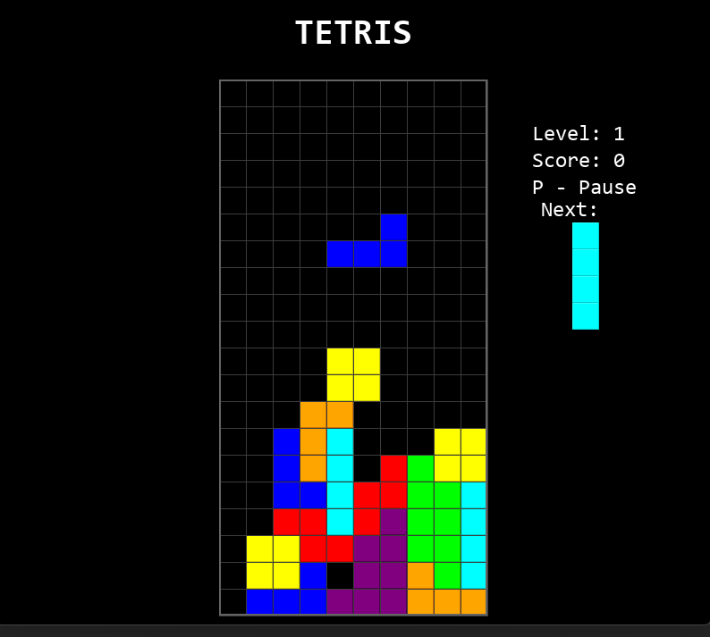

# Python Tetris Classic

A classic Tetris game implementation written in Python using the Pygame library. This project aims to recreate some core mechanics and the feel of classic Tetris versions (inspired by NES-era gameplay).

## What is Tetris?

Tetris is a tile-matching puzzle video game originally designed and programmed by Soviet software engineer Alexey Pajitnov in 1984. Players complete lines by moving differently shaped pieces (tetrominoes), which descend onto the playing field. The completed lines disappear and grant the player points, and the player can proceed to fill the vacated spaces. The game ends when the playing field is filled to the point that new pieces can no longer enter.

## Screenshot



## Features

* Classic Tetris gameplay.
* 7-Bag piece randomizer for fair piece distribution.
* NES-inspired progressive speed curve (game speeds up based on level).
* Standard scoring system (points vary by lines cleared and level) + Soft Drop points.
* Lock delay allowing last-second piece adjustments.
* Simple Wall Kick implementation for rotations near edges.
* Pseudo-3D block styling for a retro look.
* Pause functionality (P key).
* Main menu and Game Over screen.
* Exit game/menu via ESC key.

## Requirements

* Python 3.x
* Pygame library

## Installation

1.  **Clone the repository (or download source):**
    Open your terminal or command prompt and clone the repository using Git:
    ```bash
    git clone https://github.com/alexzz73/Tetris2.git
    cd Tetris2
    ```

2.  **Install Pygame:**
    If you don't have Pygame installed, run the following command in your terminal (it's recommended to use a Python virtual environment):
    ```bash
    pip install pygame
    ```

## How to Play

1.  Make sure you are in the project directory (`Tetris2`) in your terminal.
2.  Run the game script using Python:
   
    ```bash
    python tetris.py
    ```

## Controls

* **Left Arrow:** Move piece left
* **Right Arrow:** Move piece right
* **Down Arrow:** Soft drop (move piece down faster, scores points)
* **Up Arrow:** Rotate piece (includes basic wall kick)
* **Spacebar:** Hard drop (instantly drop piece to the bottom)
* **P:** Pause / Unpause game
* **ESC:** Exit game (from menu or during gameplay/pause/game over)

## License

This project is licensed under the [MIT License](https://choosealicense.com/licenses/mit/).
